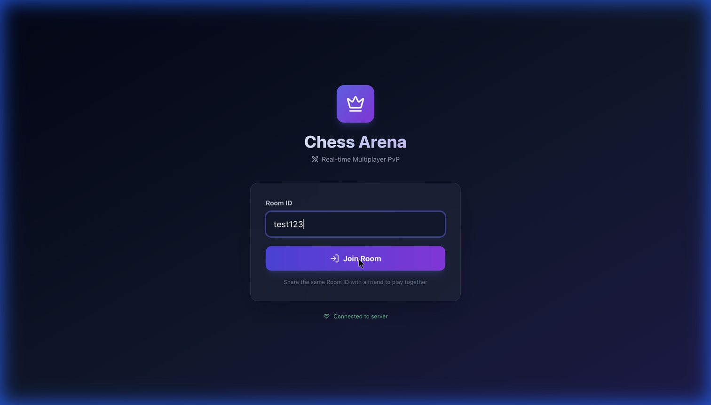
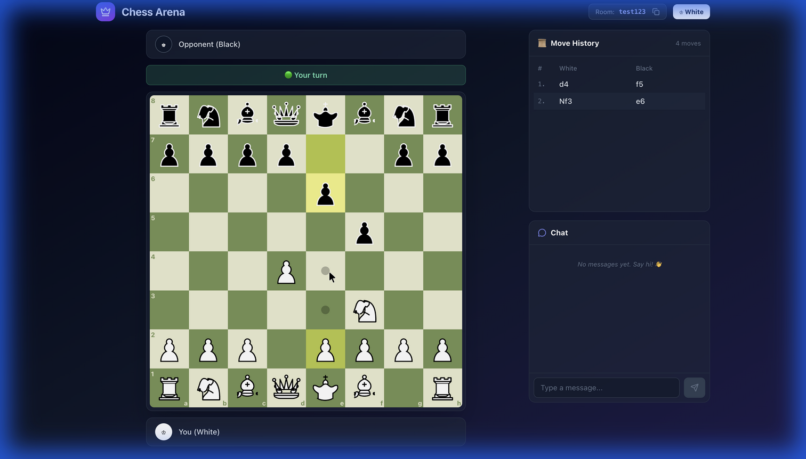
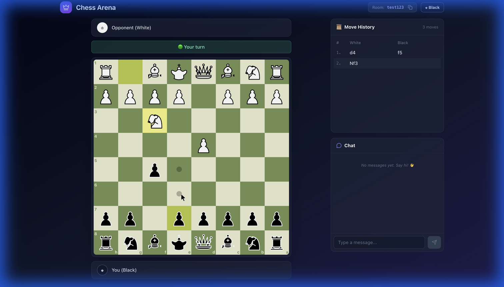

# ♟️ Real-Time Multiplayer Chess

A modern, real-time multiplayer chess application built with **React**, **Node.js**, **Socket.io**, and **Chess.js**.



## 🚀 Features

- **Real-time Multiplayer:** Instant move synchronization using WebSockets (Socket.io).
- **Lobby System:** Create or join rooms with a unique Room ID. First player is White, second is Black.
- **Board Auto-Orientation:** Board automatically flips for the Black player.
- **Move Validation:** Legal moves validation using `chess.js`.
- **In-Game Chat:** Real-time chat between opponents.
- **Move History:** Scrollable algebraic notation history.
- **Game States:** Detects Check, Checkmate, Stalemate, and Draw.
- **Disconnection Handling:** Notifies when an opponent disconnects.
- **Sound Effects:** Move and capture sounds.

## 🛠️ Tech Stack

- **Frontend:** React, TypeScript, Tailwind CSS, Lucide Icons
- **Backend:** Node.js, Express, Socket.io
- **Game Logic:** Chess.js

## 📦 Installation

1. Clone the repository:
   ```bash
   git clone https://github.com/JayAviato/realtime-chess-react.git
   cd realtime-chess-react
   ```

2. Install dependencies:
   ```bash
   npm install
   ```

## 🎮 Usage

You need to run both the backend server and the frontend client.

### 1. Start the Server (Backend)
Run the Socket.io server (default port 3001):
```bash
npm run server
```

### 2. Start the Client (Frontend)
Run the Vite development server (default port 3000):
```bash
npm run dev
```

### 3. Play!
- Open http://localhost:3000 in two different browser tabs/windows.
- **Tab 1:** Enter a Room ID (e.g., `room1`) and click **Join Room**. You will be assigned **White**.
- **Tab 2:** Enter the *same* Room ID (`room1`) and join. You will be assigned **Black**.
- The game begins!

## 📸 Screenshots

### White Perspective


### Black Perspective (Flipped Board)


## 📄 License

MIT
